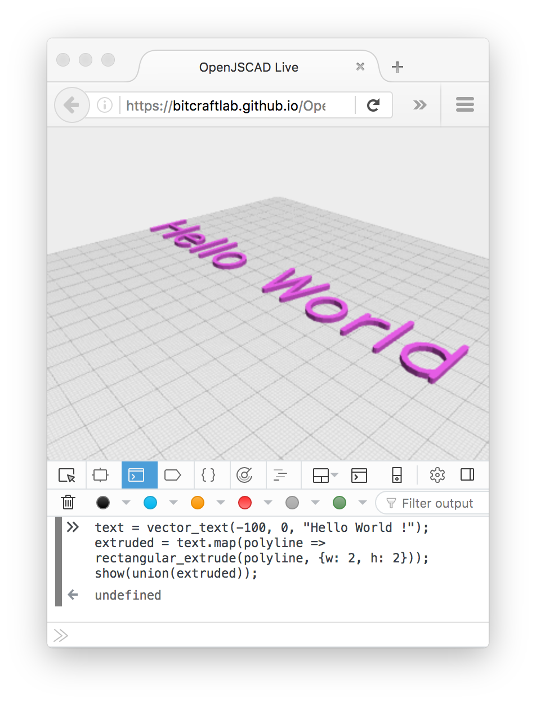

# OpenJSCAD Live

Standalone OpenJSCAD for creating 3D objects on the fly.



[OpenJSCAD](https://openjscad.org/) is a really nice tool to edit CAD in the browser.

This is a standalone version that lets you create CSG objects on the fly, rather than passing a script to the OpenJSCAD processor.

This is useful if you want to:

* create geometry using the REPL of your browser console
* harness the power of additional javascript libraries
* create a visual programming frontend for OpenJSCAD

## Programming Guide

- Check out the [OpenJSCAD Programming Guide](https://en.wikibooks.org/wiki/OpenJSCAD_User_Guide#OpenJSCAD_Programming_Guide)
- use `show()` to show the objects in the browser

## Hello World

1. Open [the web page](https://bitcraftlab.github.io/OpenJSCAD-Live) in your browser 
2. type this into the browser console:

```
text = vector_text(-100, 0, "Hello World !");
extruded = text.map(polyline => rectangular_extrude(polyline, {w: 2, h: 2}));
show(union(extruded));
```

## Links

- [Open JSCAD](https://github.com/Spiritdude/OpenJSCAD.org)
- [JSCAD Utils](https://github.com/johnwebbcole/jscad-utils)
- [Standalone Generator](https://github.com/johnwebbcole/generator-jscad)
- [Edit JSCAD in Atom](https://github.com/johnwebbcole/atom-jscad-viewer)

